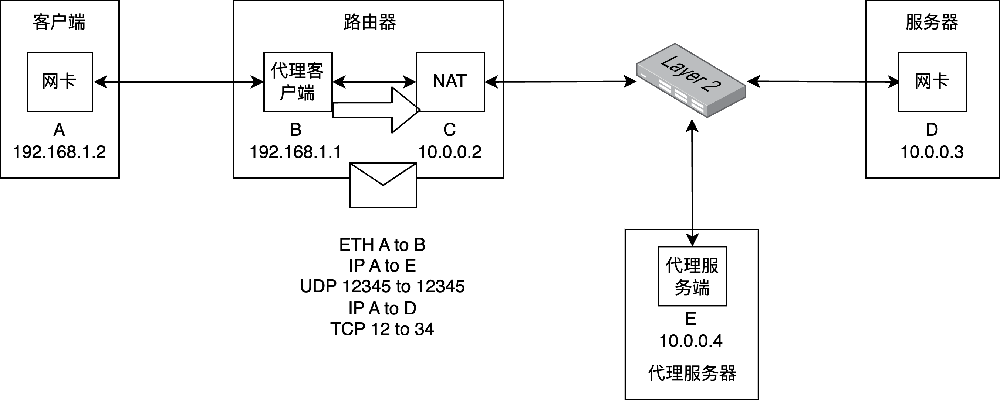
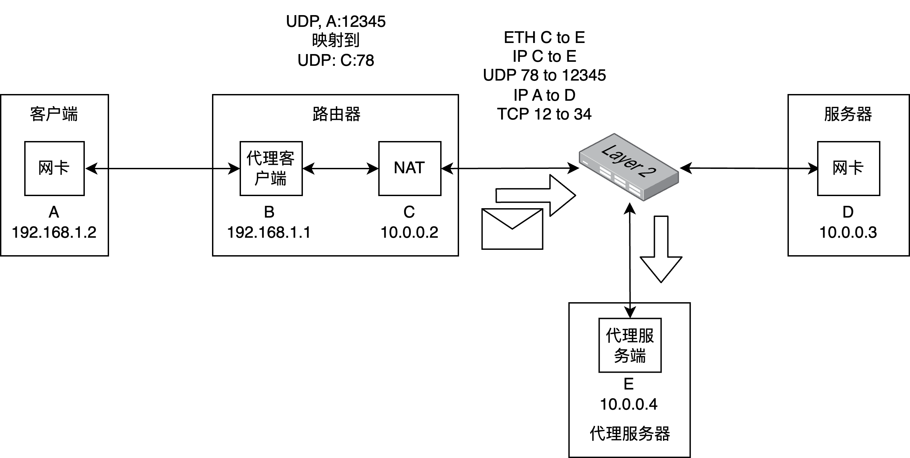

# Lab3

Lab3分为两个部分：
1. 使用ebpf技术，实现一个NAT，实现内网和外网的通信。
2. 使用ebpf技术，基于UDP协议，实现一个简单的代理。

## 1.网络结构

在Lab3中，我们考虑一个日常生活中使用的网络结构。


局域网设备通过一个路由器和广域网进行通信。
局域网设备的网关均为路由器IP。

为了简化实验，我们对网络拓扑做出如下假设：
1. 网络不存在嵌套的情况，即只有广域网和局域网两层，并且路由器只有一个接口连接到广域网。
2. 每台机器均有一个所在网段的唯一IP地址。
3. 广域网中的所有机器，通过一个交换机连接。
4. 我们规定，局域网的网段为192.168.1.0/24，广域网的网段为10.0.0.0/8。
5. 除路由器外的计算机均只有一个端口，或者连接到路由器，或者连接到广域网。

## 2. 功能要求

对于NAT，你需要实现一个程序进行地址协议转换。
对于代理，你需要实现两个程序：代理客户端和代理服务器。
代理客户端将你的报文转发到代理客户端，代理服务器将你的请求伪装成从代理服务器发出的请求发出。
他们部署的位置如下图所示：


在一个完整的工作流中，客户端发出的报文首先经过代理客户端，代理客户端根据报文的目的地址，改写报文的目的地。
然后，报文会到达路由器，经过NAT协议，发到广域网中。
最终到达目的机。
如果该报文是一个代理客户端改写的，到达代理服务器的报文，那么该报文会被代理服务器再次改写，然后转发到原本的目的地。
其他广域网服务器发出的报文会经过代理服务器改写，经过NAT发回到某个代理客户端，改写后递交给客户端上的应用程序。

> 注意事项：
> 1. 任何对报文的修改都需要对应的修改其校验和

### 2.1 NAT

对于存在广域网端口的路由器，它需要支持NAT功能。
一个路由器会有一个接口连接到广域网，以及若干个接口，连接到内网的机器。
对于这个程序，你需要实现两个模块。
一个处理所有去往广域网的报文，一个处理所有来自广域网的报文。

**模块1.** 对于来自局域网端口的报文，若下一跳将从广域网端口发出，则需要执行网络地址转换。
即若该报文源地址尚未分配广域网地址，则需要为该源地址分配一个可用广域网地址，并将报文中的源地址替换为对应广域网地址后再发出。
若没有空闲的可用广域网地址，则丢弃该报文。
该模块将被部署在路由器上，拦截所有通过广域网接口**发往**广域网的报文。
你需要检查该报文的(源地址,源头端口,传输层协议)是否存在对应的(目标广域网地址,目标广域网端口,传输层协议)的映射。
如果不存在，则通过随机算法创建一个这样的映射。
然后，根据映射替换报文中的源地址、端口后发出。

**模块2.** 对于来自广域网端口的报文，若其目的地址不是该路由器已分配的广域网地址，则直接丢弃。
否则将目的地址转换为对应的局域网地址后再上交给内核网络协议栈继续处理。
该模块将被部署在路由器上，拦截所有**来自**广域网的报文。
你需要检查该报文的(目标广域网地址,目标广域网端口,传输层协议)是否存在对应的(源地址,源头端口,传输层协议)。
如果不存在，则不处理。
如果存在，则根据映射替换报文中的目标地址、端口后递交内核网络协议栈继续处理。

### 2.2 代理客户端

代理客户端由两个模块构成。
一个模块部署在路由器上，处理所有从局域网机器去往路由器的报文。
一个模块部署在客户端上，处理所有到达客户端的报文。

**模块1.** 对于所有从客户端去往路由器的报文，我们可以通过一个报文的目的地址判断该报文是否需要通过代理来发送。
对于需要被代理的报文，我们在他们的IP头前插入一个新的IP头和UDP头，以将该报文转发到代理服务器。
更具体的，原本报文的头部格式如下：
```
|IP from 客户端 to 目标|TCP/UDP|
```
在经过代理包装后：
```
|IP from 客户端 to 代理服务器|UDP to 代理服务器端口|IP from 客户端 to 目标|TCP/UDP|
```
这样，这个报文就会被网络传输到代理服务器，而不是目标。
该模块将被部署在路由器上，拦截所有**来自**局域网端口的报文，在处理后再交给路由器。

**模块2.** 代理服务器在收到目标服务器想要发给客户端的报文时，会转发回客户端。
这些报文在到达客户端时同样经过封装，形如：
```
|IP from 代理服务器 to 客户端|UDP from 代理服务器端口|IP from 目标 to 客户端|TCP/UDP|
```
我们需要将前面的IP和UDP头去掉，还原为原本的报文形式，然后发送给客户端。
```
|IP from 目标 to 客户端|TCP/UDP|
```
该模块部署在客户端上，拦截所有**发往**客户端的报文。
如果一个报文是来自代理服务器的报文，那么去掉前面的IP头和UDP头，然后再递交给客户端。

### 2.3 代理服务端

代理服务端包含一个模块，运行在代理服务器上。
代理服务端将局域网的报文伪装成从代理服务器发出。
同时，将来自其他广域网机器的目标为代理服务器的报文，伪装成发往局域网的报文。
代理服务端的工作分为两个部分：监听来自代理客户端的报文，以及转发其他机器的报文。

**模块1.** 首先，代理服务端会通过监听UDP某个特定端口上的，来自来自代理客户端的报文。
其格式均为：
```
|IP to 代理服务端|UDP to 代理服务端|IP from 局域网|TCP/UDP from 局域网|Data|
```
第一步，我们将报文恢复为原本的格式：
```
|IP from 局域网|TCP/UDP from 局域网|Data|
```
第二步，我们需要伪装成从代理服务器访问该报文的目标机器。
因此，我们需要对源地址进行替换。
即我们需要查找一个从(局域网地址，局域网端口，传输层协议)到（代理服务器端口，传输层协议）的映射。
如果没有，则根据随机算法创建一个映射。
根据映射，将报文修改为：
```
|IP from 代理服务器|TCP/UDP from 代理服务器端口|
```
后发出，这样报文就会被认为来自代理服务器，并被发到目标机器。
其次，如果一个报文来自其他服务器，其的目的是已经被映射的（代理服务器地址，传输层协议），那么这个报文应当被转发回代理客户端。
报文原本的格式应当为：
```
|IP from 其他广域网机器 to 代理服务器|TCP/UDP to 代理服务器|
```
第一步，我们应根据映射将报文的目标地址替换回代理客户端的地址：
```
|IP to 局域网|TCP/UDP to 局域网|
```
第二步，我们重新封装该报文为代理报文。
```
|IP from 代理服务器|UDP to 代理服务器|IP to 局域网|TCP/UDP to 局域网|
```
将该报文发出后，该报文会被网络转发回代理客户端。

## 3. 样例

为了更好的理解以上的功能，我们提供了两个样例用以说明NAT和代理的工作流程。

网络的拓扑如下图所示：

所有源地址为C的报文都将被D拒绝接收。
客户端将从TCP://A:12发起一个向TCP://D:34端口的连接。

首先，客户端发起链接，发出报文：

**代理客户端.模块1**监测到该报文需要被代理，因此进行了重新封装。
这里，我们认为用于代理通信的端口为UDP的12345端口。
封装后的报文被递交给路由器进行转发：

对于一个发往广域网的报文，**NAT.模块1**创建了一个映射，并改写了该报文的源地址和端口：

部署在代理服务器上的**代理服务端.模块1**建立映射。
将该报文改写，伪装成从代理服务器发出后转发：

该报文会到达目标服务器D并被正常处理。

D回复报文时，报文会被首先发送给E。
这是因为对D来说，该回复是针对E的：

**代理服务端.模块1**检查到映射存在时，将报文进行改写，然后重新封包发回给代理客户端：

**NAT.模块2**检查到映射存在，将报文的目标地址改写，然后转发给客户端：

**代理客户端.模块2**对来自代理服务器去往客户端的报文进行解包，去掉多余的IP头和UDP头，然后递交给客户端：


对客户端上的应用程序来说，就像是在和服务器正常进行通信。
对服务器来说，就像是和代理服务器在正常通信。

## 4. 技术规范

你可以修改/添加的文件仅限于`user/`目录下的内容。
一些需要的头文件已经写在了`user/common.h`中。
我们只需要你的实现支持UDP和TCP。
在改写的过程中，我们要求IP和TCP的校验和保持正确。
UDP的校验和可以直接设置为0。

### 4.1 NAT

NAT的程序分为两个，分别为`user/nat_xdp.c`和`user/nat_tc.c`。
`user/nat_xdp.c`将被部署在router的链接广域网的接口的xdp上，用于改写来自广域网的报文。
`user/nat_tc.c`将被部署在router的链接广域网的接口的tc egress上，用于改写去往广域网的报文。

代码的入口如下：
``` c
// user/nat_xdp.c
SEC("xdp_ingress")
int xdp_ingress_func(struct xdp_md* ctx) {
    return XDP_PASS;
}
```

``` c
// user/nat_tc.c
SEC("tc_egress")
int tc_egress_func(struct __sk_buff* skb) {
    return TC_ACT_OK;
}
```

我们使用bpftool和iproute2对程序进行部署，具体部署的代码参见`scripts/load_ebpfs_router.sh`。
我们允许你在代码中使用pinning map实现不同ebpf程序之间的map共享。

### 4.2 代理

代理的程序分为三个：`user/proxy_client_router_xdp.c`、`user/proxy_client_xdp.c`以及`user/proxy_server_xdp.c`。
`user/proxy_client_router_xdp.c`部署在路由器和局域网机器连接的XDP上，用以改写要被代理的报文。
`user/proxy_server_xdp.c`部署在代理服务器到广域网接口的XDP上，用以改写代理相关的报文，以实现代理。
`user/proxy_client_xdp.c`部署在局域网机器和路由器连接的XDP上，用以解包来自代理服务器的代理报文。

**我们不要求你实现XDP中报文分段，即，我们保证所有报文在增加`sizeof(iphdr) + sizeof(udphdr)`长度后，仍然不超过MTU**

代码的入口如下：
``` c
// user/proxy_client_router_xdp.c
SEC("xdp_ingress")
int xdp_ingress_func(struct xdp_md* ctx) {
    return XDP_PASS;
}
```

``` c
// user/proxy_client_xdp.c
SEC("xdp_ingress")
int xdp_ingress_func(struct xdp_md* ctx) {
    return XDP_PASS;
}
```

``` c
// user/proxy_server.c

#define DST_IP 0x0300000a                               // 目标IP地址一定为 10.0.0.3
#define DST_ETH 0x02, 0xa2, 0xa3, 0xa4, 0xa5, 0xa6      // 目标IP地址对应的Ethernet地址 一定为 0x02, 0xa2, 0xa3, 0xa4, 0xa5, 0xa6

SEC("xdp_ingress")
int xdp_ingress_func(struct xdp_md* ctx) {
    return XDP_PASS;
}
```

我们使用bpftool和iproute2对程序进行部署，具体部署的代码参见`scripts/load_ebpfs_proxy_client.sh`、`scripts/load_ebpfs_proxy_server.sh`以及`scripts/load_ebpfs_router.sh`。

我们将如下的报文发送到`user/proxy_client_router_xdp.c`上，以添加/删除代理规则。
对于命中代理规则的报文，应当使用代理进行通信。
``` c
struct ethhdr {
    ...
    uint16_t h_proto = 0x0101(添加一个规则)/0x0202(删除一个规则);
};
struct iphdr {
    ...
    uint32_t dst_ip = 0x0300000a;               // 规则的目标IP，在我们的实验中一定为10.0.0.3，即0x0300000a
    ...
    uint8_t protocol = IPPROTO_UDP/IPPROTO_TCP; // 规则的目标传输层协议
};
struct tcp/udphdr {
    ...
    uint16_t dest;                              // 规则的目标端口
}
```
相关的结构体包括`struct ethhdr, struct iphdr, struct tcphdr, struct udphdr`均在`netinet`头中有完整的定义。

## 5. 本地运行与测试

## 6. 分数计算
