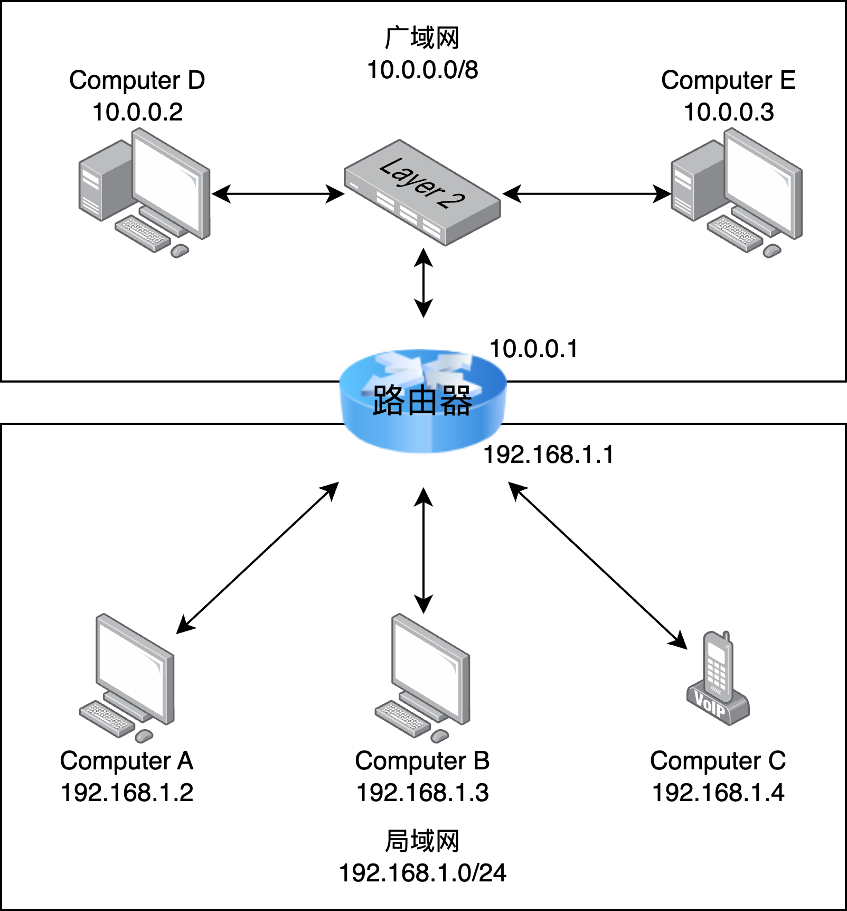
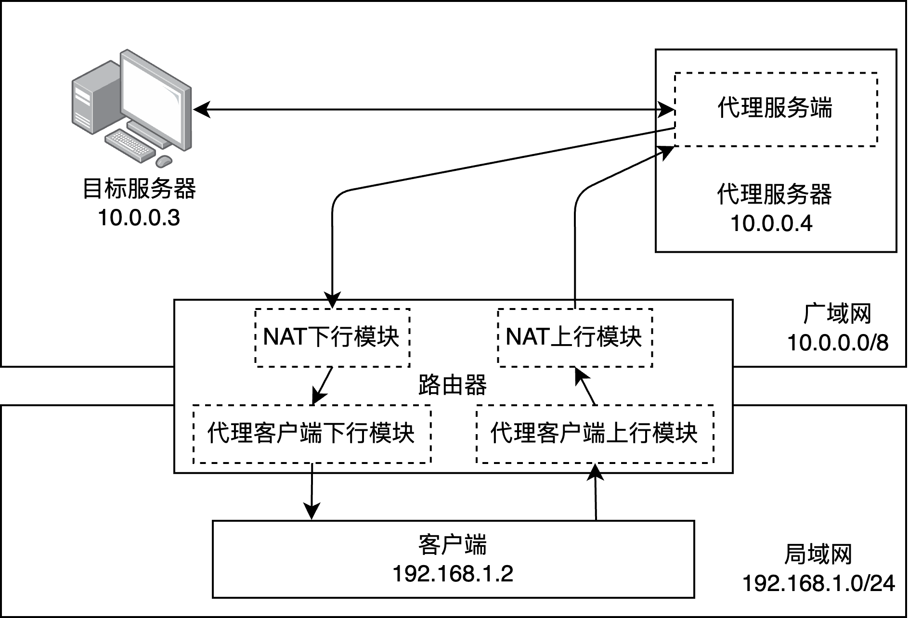
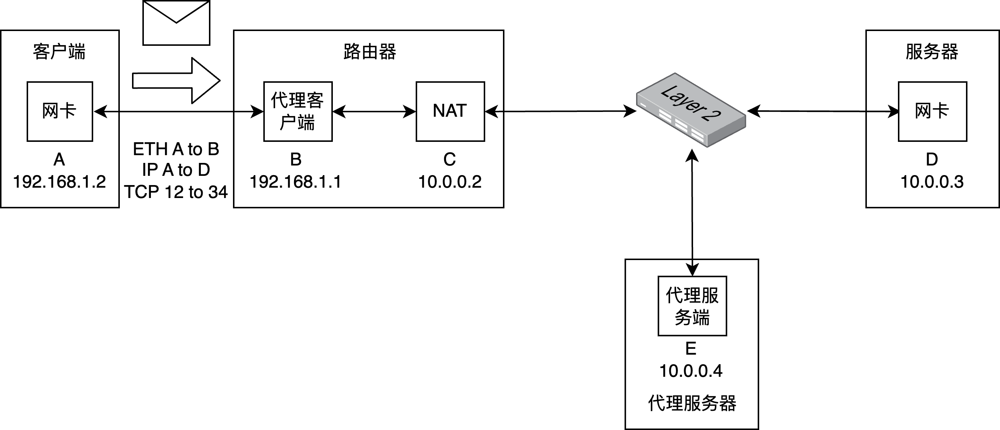
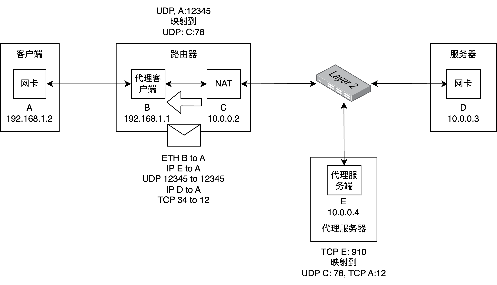

# Lab3

Lab3分为两个部分：
1. 使用ebpf技术，实现一个NAT，实现内网和外网的通信。
2. 使用ebpf技术，基于UDP协议，实现一个简单的代理。

## 1.网络结构

在Lab3中，我们考虑一个日常生活中使用的网络结构。



局域网设备通过一个路由器和广域网进行通信。
局域网设备的网关均为路由器IP。


为了简化实验，我们对网络拓扑做出如下假设：
1. 网络不存在嵌套的情况，即只有广域网和局域网两层，并且路由器只有一个接口连接到广域网。
2. 每台机器均有一个所在网段的唯一IP地址。
3. 广域网中的所有机器，通过一个交换机连接。
4. 我们规定，局域网的网段为192.168.1.0/24，广域网的网段为10.0.0.0/8。
5. 除路由器外的计算机均只有一个端口，或者连接到路由器，或者连接到广域网。

## 2. 功能要求

这一节将描述你要实现的三个程序的功能，他们分别是NAT、代理客户端和代理服务端。
他们的运行位置如图所示：


### 2.1 NAT

对于存在广域网端口的路由器，它需要支持NAT功能。
该功能需要用ebpf实现，并部署在路由器的和广域网连接的端口上。

对于来自局域网端口的报文，若下一跳将从广域网端口发出，则需要执行网络地址转换。
即若该报文源地址尚未分配广域网地址，则需要为该源地址分配一个可用广域网地址，并将报文中的源地址替换为对应广域网地址后再发出。
若没有空闲的可用广域网地址，则丢弃该报文。
若已分配地址，则直接将源地址转换为对应广域网地址后发出。
对于来自广域网端口的报文，若其目的地址不是该路由器已分配的广域网地址，则直接丢弃。
否则将目的地址转换为对应的局域网地址后再上交给内核网络协议栈。

### 2.2 代理客户端

代理客户端是由几个ebpf程序构成（详见4.2）

运行在路由器ingress的程序将需要代理的报文重新封装，封装为**代理报文**。
更具体的来说，一个即将发送的报文的报文头部为：
```
|IP|TCP/UDP|Data|
```
对于需要进行代理的报文，报文头会被修改为：
```
|IP to 代理服务端|UDP to 代理服务端|IP|TCP/UDP|Data|
```
这个报文会被发送给代理服务端。

> 更有趣的是，你可以在这里对你的报文内容进行加密（不是课程要求）

运行在客户端机器ingress在收到**代理报文**时，对代理报文进行解封装。
更具体的说，一个代理报文为：
```
|IP from 代理服务器|UDP from 代理服务器|IP|TCP/UDP|Data|
```
该报文将被解包为：
```
|IP|TCP/UDP|Data|
```

### 2.3 代理服务端

代理服务端是一个ebpf程序，运行在广域网中某台机器网络接口的ingress上。
通过代理服务器，局域网内的机器和目标机器进行通信。
代理服务器的工作分为两个部分：监听来自代理客户端的报文，以及转发来自目标机器的报文。

首先，代理服务端会通过监听UDP某个特定端口上的，来自来自代理客户端的报文。
其格式均为
```
|IP to 代理服务端|UDP to 代理服务端|IP from 局域网|TCP/UDP from 局域网|Data|
```
第一步，我们将报文恢复为原本的格式：
```
|IP from 局域网|TCP/UDP from 局域网|Data|
```
第二步，我们需要伪装成从代理服务器访问该报文的目标机器。
因此，我们需要对源地址进行替换。
即若该报文源地址尚未分配一个代理服务器的广域网地址，则需要为该源地址分配一个可用广域网地址，并将报文中的源地址替换为对应广域网地址后再发出。

其次，如果一个报文的目的地址是已经被分配的广域网地址，那么这个报文应当被转发给某个代理客户端。
第一步，我们应将报文的目标地址替换回代理客户端的地址：
```
|IP to 局域网|TCP/UDP to 局域网|Data|
```
第二步，我们重新封装该报文为代理报文。
```
|IP from 代理服务器|UDP to 代理服务器|IP to 局域网|TCP/UDP to 局域网|Data|
```

## 3. 样例

为了更好的理解以上的功能，我们提供了两个样例用以分别说明NAT和代理的工作流程。

### 3.1 NAT

网络的拓扑简化为:

首先，客户端从端口12发起连接，到服务器D的端口34：

在C的egress上的ebpf程序将该报文进行NAT：

该报文将到达D。

D收到报文，需要发回报文：

在C的ingress上的epbf程序将该报文根据映射进行转换：

最终报文可以从D到达A。
这样，局域网的机器就能和广域网的机器正常通信。

如果不进行该转换，广域网机器将收到来自A的IP报文，但是广域网机器无法获取局域网机器的Ethernet地址，因而无法回复报文。

### 3.2 代理

网络的拓扑简化为：

所有源地址为C的报文都将被D拒绝接收。

首先，客户端发起链接，发出报文：

部署在B上的代理程序进行封包：

这里，我们认为用于代理通信的端口为UDP的12345端口。
通过部署在C口的NAT程序后：

部署在E口的代理服务器程序建立映射，并转发报文给服务器：

报文的源地址为E因此可以被服务器接收并处理。

E回复报文时：

代理服务器检查到映射存在时，将报文进行封包，然后转发：

通过NAT，报文到达A：

A上的代理客户端对UDP目标端口为12345的报文进行解包，然后上交给客户端协议栈：


对客户端来说，就像是在和服务器正常进行通信。

## 4. 技术规范

你可以修改/添加的文件仅限于`user/`目录下的内容。
一些需要的头文件已经写在了`user/common.h`中。
我们只需要你的实现支持UDP和TCP。
在改写的过程中，我们要求IP和TCP的校验和保持正确。
UDP的校验和可以直接设置为0。

### 4.1 NAT

NAT的程序分为两个，分别为`user/nat_xdp.c`和`user/nat_tc.c`。
`user/nat_xdp.c`将被部署在router的链接广域网的接口的xdp上，用于改写来自广域网的报文。
`user/nat_tc.c`将被部署在router的链接广域网的接口的tc egress上，用于改写去往广域网的报文。

代码的入口如下：
``` c
// user/nat_xdp.c
SEC("xdp_ingress")
int xdp_ingress_func(struct xdp_md* ctx) {
    return XDP_PASS;
}
```

``` c
// user/nat_tc.c
SEC("tc_egress")
int tc_egress_func(struct __sk_buff* skb) {
    return TC_ACT_OK;
}
```

我们使用bpftool和iproute2对程序进行部署，具体部署的代码参见`scripts/load_ebpfs_router.sh`。
我们允许你在代码中使用pinning map实现不同ebpf程序之间的map共享。

### 4.2 代理

代理的程序分为三个：`user/proxy_client_router_xdp.c`、`user/proxy_client_xdp.c`以及`user/proxy_server_xdp.c`。
`user/proxy_client_router_xdp.c`部署在路由器和局域网机器连接的XDP上，用以改写要被代理的报文。
`user/proxy_server_xdp.c`部署在代理服务器到广域网接口的XDP上，用以改写代理相关的报文，以实现代理。
`user/proxy_client_xdp.c`部署在局域网机器和路由器连接的XDP上，用以解包来自代理服务器的代理报文。

**我们不要求你实现XDP中报文分段，即，我们保证所有报文在增加`sizeof(iphdr) + sizeof(udphdr)`长度后，仍然不超过MTU**

代码的入口如下：
``` c
// user/proxy_client_router_xdp.c
SEC("xdp_ingress")
int xdp_ingress_func(struct xdp_md* ctx) {
    return XDP_PASS;
}
```

``` c
// user/proxy_client_xdp.c
SEC("xdp_ingress")
int xdp_ingress_func(struct xdp_md* ctx) {
    return XDP_PASS;
}
```

``` c
// user/proxy_server.c

#define DST_IP 0x0300000a                               // 目标IP地址一定为 10.0.0.3
#define DST_ETH 0x02, 0xa2, 0xa3, 0xa4, 0xa5, 0xa6      // 目标IP地址对应的Ethernet地址 一定为 0x02, 0xa2, 0xa3, 0xa4, 0xa5, 0xa6

SEC("xdp_ingress")
int xdp_ingress_func(struct xdp_md* ctx) {
    return XDP_PASS;
}
```

我们使用bpftool和iproute2对程序进行部署，具体部署的代码参见`scripts/load_ebpfs_proxy_client.sh`、`scripts/load_ebpfs_proxy_server.sh`以及`scripts/load_ebpfs_router.sh`。

我们将如下的报文发送到`user/proxy_client_router_xdp.c`上，以添加/删除代理规则
``` c
struct ethhdr {
    ...
    uint16_t h_proto = 0x0101(添加一个规则)/0x0202(删除一个规则);
};
struct iphdr {
    ...
    uint32_t dst_ip = 0x0300000a;               // 规则的目标IP，在我们的实验中一定为10.0.0.3，即0x0300000a
    ...
    uint8_t protocol = IPPROTO_UDP/IPPROTO_TCP; // 规则的目标传输层协议
};
struct tcp/udphdr {
    ...
    uint16_t dest;                              // 规则的目标端口
}
```
相关的结构体包括`struct ethhdr, struct iphdr, struct tcphdr, struct udphdr`均在`netinet`头中有完整的定义。

## 5. 本地运行与测试

## 6. 分数计算
